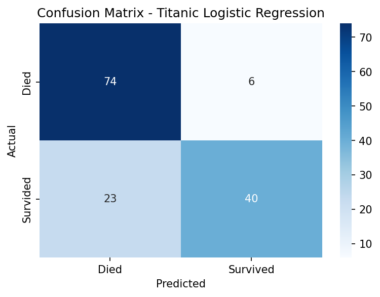
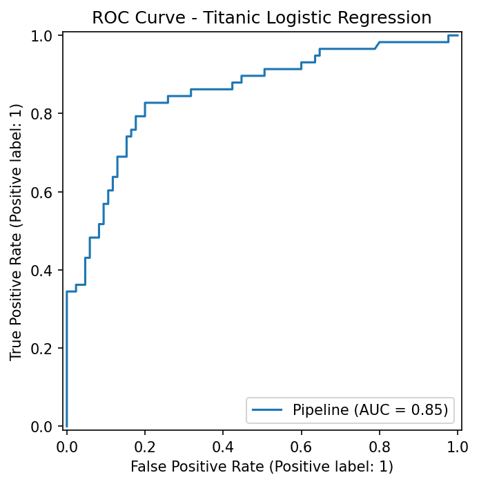
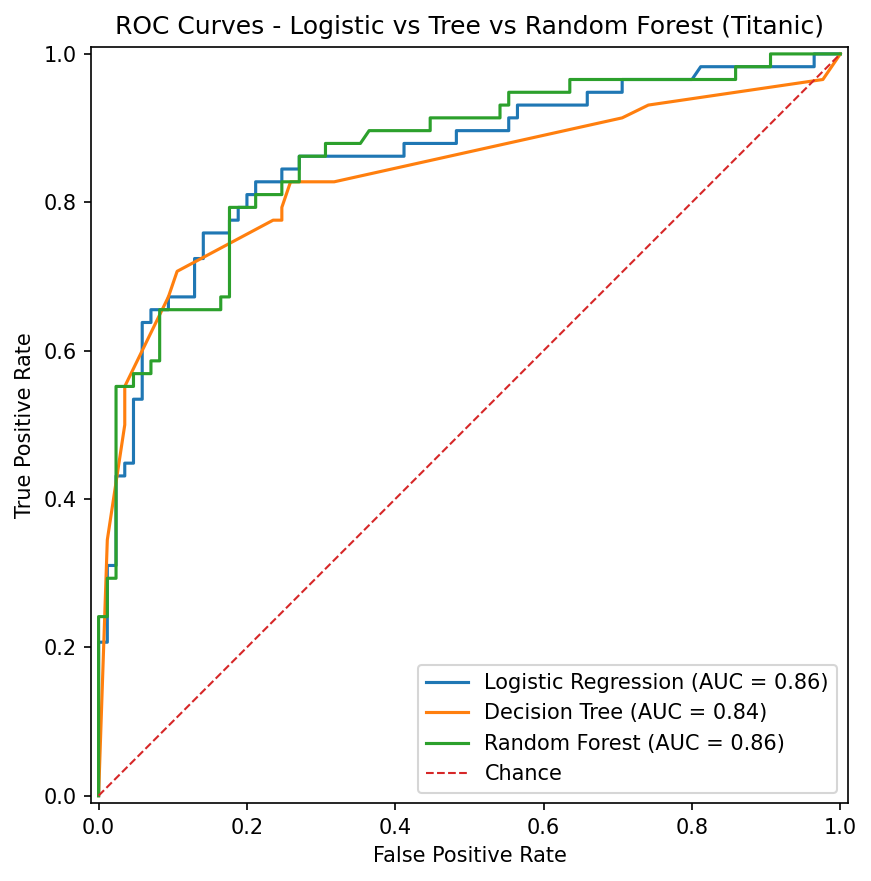

# 🚀 ML Journey  

Documenting my path from learning to becoming a **Machine Learning Engineer**.  
This repo contains projects, code, and results as I practice and build up my skills.  

---

## 📂 Repository Structure  

- **/notebooks** → Jupyter notebooks by project  
- **/docs** → results, plots, and notes  
- **requirements.txt** → dependencies to recreate my environment  

---

## 📆 Progress Log  

### ✅ Day 1 - California Housing Regression  
- Built a regression model using **Linear Regression** and **Ridge Regression**  
- Compared performance and documented results in Markdown + plots  
- [Notebook](notebooks/01_california_regression.ipynb)  

---

### ✅ Day 2 - Titanic Logistic Regression  
- Built a classification model on Titanic dataset using **Logistic Regression**  
- Features: sex, age, fare, class, embarked  
- Evaluated with **Accuracy, Precision, Recall, F1, ROC-AUC**  
- Visualized results with a Confusion Matrix  

Artifacts:  
- [Notebook](notebooks/02_titanic_classification.ipynb)  
- [Results](docs/titanic_results.md)  
-   

---

### ✅ Day 3 - Logistic Regression with Cross-Validation + ROC Curve  
- Expanded features: sex, age, fare, class, embarked, sibsp, parch, alone  
- Used **Stratified 5-fold cross-validation** for robust performance estimates  
- Evaluated multiple metrics (Accuracy, F1, ROC-AUC)  
- Visualized the ROC Curve on a holdout test set
  
Artifacts:  
- [Notebook](notebooks/03_titanic_logreg_cv.ipynb)  
- [CV Results](docs/titanic_cv_results.md)  
-   

### ✅ Day 4 - Feature Engineering + Tree Baselines
- Engineered features: `family_size`, `is_child`, `fare_per_person`
- Compared **Logistic Regression**, **Decision Tree**, **Random Forest**
- 5-fold CV (Accuracy, F1, ROC-AUC) + ROC overlay plot

Artifacts:
- [Notebook](notebooks/04_titanic_feature_engineering_trees.ipynb)  
- [CV Results](docs/titanic_day4_cv_results.md)  
- 

### ✅ Day 5 - Credit Card Fraud Detection (Imbalanced Data)

- Worked with the Kaggle Credit Card Fraud Detection dataset (~285k transactions, only 0.17% fraud)

- Built baseline Logistic Regression and Random Forest models

- Highlighted why raw accuracy is misleading in imbalanced settings

- Evaluated with ROC-AUC and Precision-Recall AUC

- Applied class weights and SMOTE oversampling to improve recall

- Performed threshold scanning to balance precision and recall trade-offs

Artifacts:
- [Notebook](notebooks/05_creditcard_imbalanced.ipynb)
- [Results](docs/creditcard_results.md)
- Plots saved under 'docs/'

---

## 🛠️ Tech Stack  

  
  
  
  

---

## ⚙️ How to Run  

Clone the repo:  
```bash
git clone https://github.com/ernestog27/ml-journey.git
cd ml-journey


---

## 👨🏾‍💻 Connect

[LinkedIn](https://linkedin.com/in/eg-data)

[YouTube](https://youtube.com/@ErnestoData)

[GitHub Repos](https://github.com/ernestog27) 

